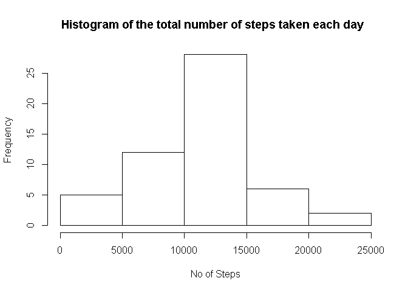
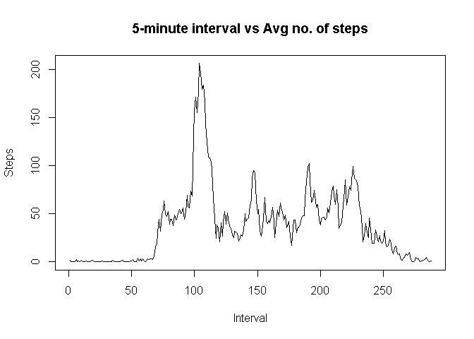
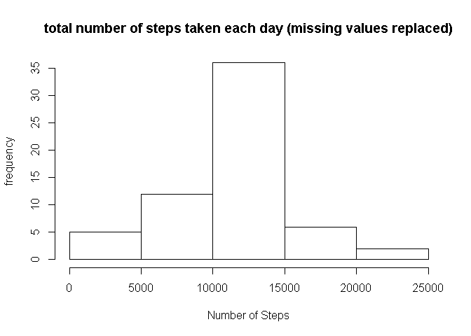

# Reproducible Research: Peer Assessment 1


### Loading and preprocessing the data
* Load the data (i.e. read.csv())

```r
data<-read.csv("activity.csv", na.strings="NA", stringsAsFactors=FALSE)
```
* Process/transform the data (if necessary) into a format suitable for your analysis

```r
data<-read.csv("activity.csv", na.strings="NA", stringsAsFactors=FALSE)

filtered<-data[complete.cases(data),]
aggregatedData<-aggregate(steps ~ date, data = filtered, sum, na.rm = TRUE)
```

### What is mean total number of steps taken per day?
For this part of the assignment, you can ignore the missing values in the dataset.

* Make a histogram of the total number of steps taken each day  

```r
hist(aggregatedData$steps,xlab="No of Steps",ylab="Frequency",main="Histogram of the total number of steps taken each day  ")
```

 

* Calculate and report the mean and median total number of steps taken per day

```r
dataMean<-mean(aggregatedData$steps)
dataMedian<-median(aggregatedData$steps)
dataMean
```

```
## [1] 10766.19
```

```r
dataMedian
```

```
## [1] 10765
```

### What is the average daily activity pattern?
* Make a time series plot (i.e. type = "l") of the 5-minute interval (x-axis) and the average number of steps taken, averaged across all days (y-axis)

```r
aggregatedStep2<-aggregate(steps ~ interval, data=filtered, mean)
plot(aggregatedStep2$steps, type='l',main="5-minute interval vs Avg no. of steps", xlab="Interval",ylab="Steps")
```

 

* Which 5-minute interval, on average across all the days in the dataset, contains the maximum number of steps?

```r
aggregatedStep2[aggregatedStep2$steps==max(aggregatedStep2$steps),1]
```

```
## [1] 835
```

### Imputing missing values
Note that there are a number of days/intervals where there are missing values (coded as NA). The presence of missing days may introduce bias into some calculations or summaries of the data.

* Calculate and report the total number of missing values in the dataset (i.e. the total number of rows with NAs)

```r
nrow(data[!complete.cases(data),])
```

```
## [1] 2304
```
* Devise a strategy for filling in all of the missing values in the dataset. The strategy does not need to be sophisticated. For example, you could use the mean/median for that day, or the mean for that 5-minute interval, etc.
* Create a new dataset that is equal to the original dataset but with the missing data filled in.

<font color='red'>The strategy is to use the mean for the particular 5 minute interval</font>


```r
#mean for that 5-minute interval
#Reuse the "data" variable
for (intIndex in 1:nrow(data)){
  #cant use complete.cases in case some columns have NA
  if (is.na(data[intIndex,1])){
    data[intIndex,1] <- aggregatedStep2$steps[which(aggregatedStep2$interval == data[intIndex,3])]
  }
}
```

* Make a histogram of the total number of steps taken each day and Calculate and report the mean and median total number of steps taken per day. Do these values differ from the estimates from the first part of the assignment? What is the impact of imputing missing data on the estimates of the total daily number of steps?

```r
newAggregatedData<-aggregate(steps ~ date, data = data, sum, na.rm = TRUE)
hist(newAggregatedData$steps, main="total number of steps taken each day (missing values replaced)", xlab="Number of Steps", ylab="frequency")
```

 

```r
newDataMean<-mean(newAggregatedData$steps)
newDataMedian<-median(newAggregatedData$steps)

abs(newDataMean - dataMean)
```

```
## [1] 0
```

```r
abs(newDataMedian - dataMedian)
```

```
## [1] 1.188679
```
<font color='red'>The mean doesnt differ, the median differ slightly although it is likely not to be statistically significant</font>

### Are there differences in activity patterns between weekdays and weekends?

For this part the weekdays() function may be of some help here. Use the dataset with the filled-in missing values for this part.

* Create a new factor variable in the dataset with two levels -- "weekday" and "weekend" indicating whether a given date is a weekday or weekend day.

```r
data$weekday <- weekdays(as.POSIXlt(as.Date(data$date)))
for (intIndex in 1:nrow(data)){
  #cant use complete.cases in case some columns have NA
  if (data[intIndex,4] %in% c('Saturday', 'Sunday')){
    data[intIndex,4]<-'weekend'
  }else{
    data[intIndex,4]<-'weekday'
  }
}
```

* Make a panel plot containing a time series plot (i.e. type = "l") of the 5-minute interval (x-axis) and the average number of steps taken, averaged across all weekday days or weekend days (y-axis). The plot should look something like the following, which was created using simulated data:

```r
weekdayTest<-aggregate(steps ~ interval, data=data[data$weekday=="weekday",], mean)
weekendTest<-aggregate(steps ~ interval, data=data[data$weekday=="weekend",], mean)
weekdayTest$weekday="weekday"
weekendTest$weekday="weekend"
dataFull<-rbind(weekdayTest, weekendTest)


library(lattice)
xyplot(steps ~ interval | weekday, data=dataFull, layout=c(1,2), type="l",ylab="Number of steps", xlab="Interval", log=10)
```

 

<font color=red>Side Note: Using log(steps) ~ interval will result in a broken xyplot. I am not sure how to fix this</font>
